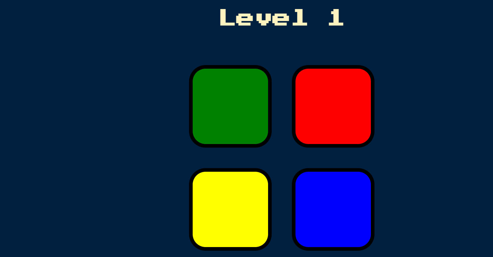

# 🎮 Simon Game

A web-based version of the classic **Simon Game** to test your memory by repeating an increasingly difficult sequence of lights and sounds.

## 📸 Preview
 

## 🧠 How to Play
1. Press **A** to begin the game.
2. Watch the sequence of lights and sounds.
3. Repeat the sequence by clicking the buttons in the same order.
4. The sequence grows longer each round. Keep going until you make a mistake!

## 💡 Features
- Classic Simon game logic with growing sequences.
- Interactive colored buttons with sound feedback.
- Game-over animation and restart functionality.
- Mobile-responsive design (if applicable).

## 🛠️ Tech Stack
- **HTML5**
- **CSS3**
- **JavaScript**

## 📂 Folder Structure
├── index.html
├── style.css
├── script.js
└── sounds.mp3
